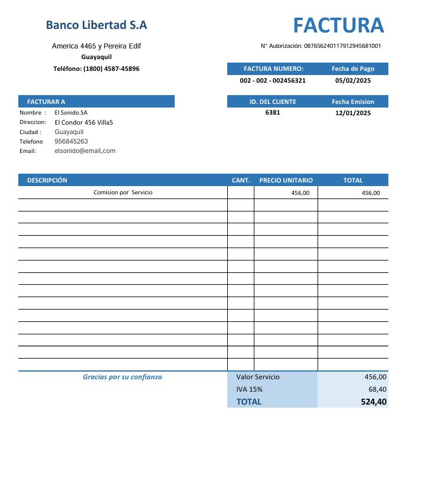
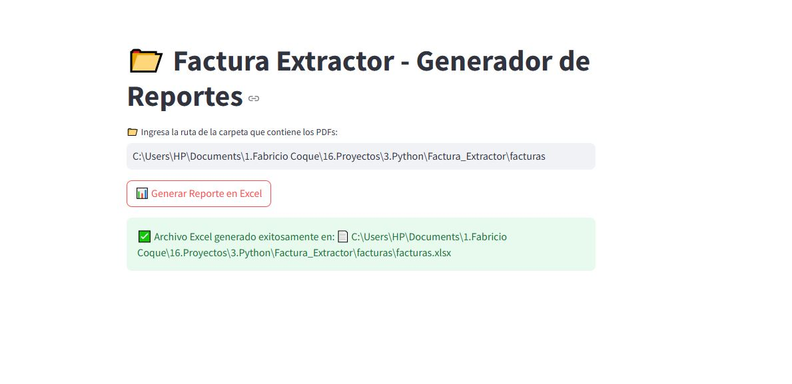
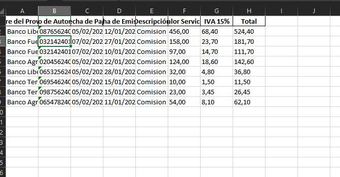

# 📂 Factura Extractor - Generador de Reportes PDF a Excel 

Apliacion que permite automatizar la extraccion de información clave de facturas en formato PDF y generar un reporte organizado en Excel. La aplicación facilita la automatización de la extracción de datos como el número de factura, fecha, proveedor, importe y otros detalles esenciales, utilizando **pdfplumber** para procesar los archivos PDF y **pandas** para organizar y generar el reporte.

##  Características
- **Carga de archivos PDF**: Permite seleccionar una carpeta con archivos PDF que contienen las facturas.
- **Extracción de datos clave**: Extrae datos como número de factura, fecha, proveedor, importe, IVA y otros usando **pdfplumber**.
- **Generación de reportes**: El reporte se guarda en un archivo **Excel** con los datos estructurados.
- **Interfaz sencilla**: La aplicación, desarrollada con **Streamlit**, permite una fácil interacción y uso sin necesidad de conocimientos avanzados.

## 🛠️ Tecnologías Utilizadas
- **Python**: Lenguaje de programación principal.
- **Streamlit**: Framework para la interfaz gráfica.
- **pdfplumber**: Herramienta para la extracción de texto desde archivos PDF.
- **pandas**: Para manejo de datos y creación de reportes en Excel.
- **openpyxl**: Librería para la creación y modificación de archivos Excel.
- **os**: Módulo para la manipulación de archivos y directorios.
- **re**: Módulo de expresiones regulares para estructurar los datos extraídos de los PDF.

## 📂 Estructura del Proyecto

```
📂 factura-extractor
│── 📂 facturas                # Carpeta que contiene las facturas PDF para procesar
│   │── factura1.pdf
│   │── factura2.pdf
│   │── factura3.pdf
│   └── ...
│── 📂 src
│   │── extractor.py           # Función para extraer texto de PDFs utilizando pdfplumber
│   │── datos_clave.py         # Función para estructurar los datos extraídos
│── app.py                     # Aplicación principal basada en Streamlit
│── README.md                  # Documentación del proyecto
```

## 📝 Descripción de las Funciones

### ✅ Extracción de texto de los PDFs
El proyecto utiliza la librería **pdfplumber** para abrir los archivos PDF y extraer el texto de manera precisa. **pdfplumber** permite acceder al contenido textual y estructurarlo de manera eficiente, especialmente cuando las facturas contienen tablas.



### ✅ Extracción y Estructuración de Datos Clave
Una vez que el texto es extraído de los PDFs, se utilizan expresiones regulares (con la librería **re**) para identificar patrones clave en el texto, como:

- **Fecha de la factura**: Se busca un formato de fecha común.
- **Fecha de pago**: Se extrae el formato correspondiente.
- **Proveedor y detalles financieros**: Se extraen importes, IVA, y otros datos financieros de la factura.
- **Número de factura**: Se extrae utilizando un patrón específico para números.
- **Descripción del servicio prestado**.
- **Valor del servicio**.
- **IVA 15 %**.
- **Valor total**.

### ✅ Generación de Reporte en Excel
Una vez que los datos se han extraído y estructurado, se organizan en un **DataFrame** utilizando **pandas**, y luego se guardan en un archivo **Excel** utilizando **openpyxl**.




## 📌 Notas Importantes
- **Formato de las facturas**: La precisión de la extracción depende de la estructura de las facturas. Las facturas que no siguen un formato consistente podrían requerir ajustes adicionales en las expresiones regulares.
- **Validación de archivos PDF**: Asegúrate de que los archivos PDF estén correctamente formateados y sean legibles. La aplicación no valida ni corrige documentos corruptos o ilegibles.

## Mejoras Futuras
- **Soporte para más formatos de facturas**: Agregar más patrones para soportar distintos tipos de facturas.
- **Vista previa de los datos extraídos**: Incluir una opción para mostrar una vista previa antes de generar el archivo Excel.
- **Validación de datos**: Implementar validaciones adicionales para los campos extraídos (por ejemplo, validar que los números de factura no se repitan).


Creado por Fabricio Coque
